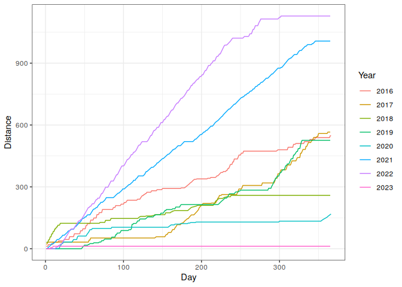
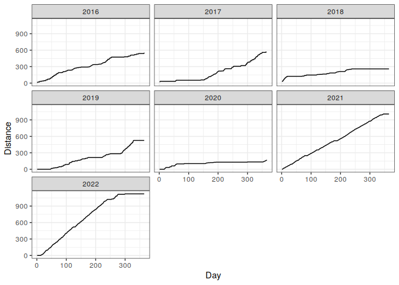
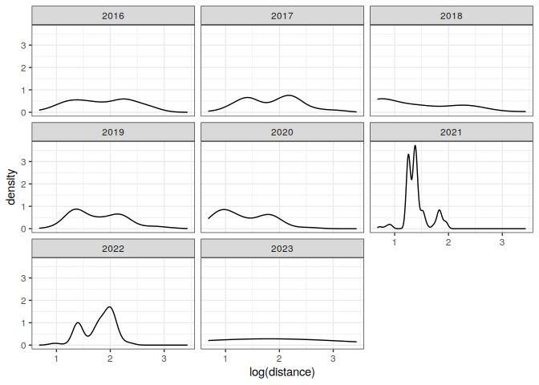

Exploratory analysis of my running activities
================
Dmitrii Tereshchenko

## Loading the data

``` r
run_data <- read_csv("run_data.csv")
```

    ## Rows: 2557 Columns: 2
    ## ── Column specification ────────────────────────────────────────────────────────
    ## Delimiter: ","
    ## dbl  (1): distance
    ## date (1): date
    ## 
    ## ℹ Use `spec()` to retrieve the full column specification for this data.
    ## ℹ Specify the column types or set `show_col_types = FALSE` to quiet this message.

``` r
run_data %>% glimpse()
```

    ## Rows: 2,557
    ## Columns: 2
    ## $ date     <date> 2016-01-01, 2016-01-02, 2016-01-03, 2016-01-04, 2016-01-05, …
    ## $ distance <dbl> 12.16, NA, NA, 8.50, NA, NA, NA, NA, NA, 11.00, NA, NA, NA, N…

## Dealing with variables

``` r
run_data <- run_data %>% 
  mutate(distance = replace_na(distance, 0),
         year = year(date),
         month = month(date),
         week = week(date)) %>%
  group_by(year) %>% 
  mutate(cum_distance = cumsum(distance)) %>%
  ungroup()
```

## Comparing weekly and monthly activities by year

``` r
run_data %>% 
  group_by(year, week) %>%
  summarise(week_dist = sum(distance)) %>%
  pivot_wider(id_cols = week, names_from = year, values_from = week_dist)
```

    ## `summarise()` has grouped output by 'year'. You can override using the
    ## `.groups` argument.

    ## # A tibble: 53 × 8
    ##     week `2016` `2017` `2018` `2019` `2020` `2021` `2022`
    ##    <dbl>  <dbl>  <dbl>  <dbl>  <dbl>  <dbl>  <dbl>  <dbl>
    ##  1     1   20.7   32.1   57.5   0      0      18.0   0   
    ##  2     2   11      0     47.7   0      0      22.4   6.76
    ##  3     3    6.5    0     18.2   0     25.3    18.6  19.4 
    ##  4     4    7      0      0     0      7.38   20.3  41.7 
    ##  5     5   13.5    0      0     0      5.89   14.9  27.8 
    ##  6     6   14      0      0     0     23.0    27.4  37.0 
    ##  7     7   24      0      0    13.4    0      25.9  27.0 
    ##  8     8   25.3   10      0     7.45  22.8    16.7  40.0 
    ##  9     9   27.3   10      0     7.92  13.6    28.3  25.3 
    ## 10    10   26      0      4.2   3.61   0      26.3  28.0 
    ## # … with 43 more rows

``` r
run_data %>% 
  group_by(year, month) %>%
  summarise(month_dist = sum(distance)) %>%
  pivot_wider(id_cols = year, names_from = month, values_from = month_dist)
```

    ## `summarise()` has grouped output by 'year'. You can override using the
    ## `.groups` argument.

    ## # A tibble: 7 × 13
    ## # Groups:   year [7]
    ##    year   `1`   `2`   `3`   `4`   `5`   `6`   `7`   `8`   `9`  `10`  `11`  `12`
    ##   <dbl> <dbl> <dbl> <dbl> <dbl> <dbl> <dbl> <dbl> <dbl> <dbl> <dbl> <dbl> <dbl>
    ## 1  2016  58.7  80.3  70.3  31    51.8  14.9  38.9  89.3  38.2  6.4   39.8  28.2
    ## 2  2017  32.1  20     0     0     6    84.4  77    43.0  44.4 75.7  114.   69  
    ## 3  2018 123.    0    23.3   6.2  12.2  19.5  25.8  48.5   0    0      0     0  
    ## 4  2019   0    25.0  42.9  67.0  37.7  41.6   0    57.7  12.2 98.8  143.    0  
    ## 5  2020  32.7  65.4   6     0     0    17.8   7.6   0     0    4.19   0    34.7
    ## 6  2021  87.2  89.7  82.2  94.0  84.2  82.5  74.7 107.   95.0 87.5   98.4  25.2
    ## 7  2022  88.3 124.  139   152.  116.  141.  136.  126.   69.1 32.0    0     0

## Overall descriptive statistics by year

``` r
run_data %>% 
  filter(distance > 0) %>%
  group_by(year) %>%
  summarise(n = n(), 
            mean = mean(distance), 
            median = median(distance), 
            min = min(distance),
            max = max(distance), 
            sum = sum(distance))
```

    ## # A tibble: 7 × 7
    ##    year     n  mean median   min   max   sum
    ##   <dbl> <int> <dbl>  <dbl> <dbl> <dbl> <dbl>
    ## 1  2016    75  7.30   6.4   2    17     548.
    ## 2  2017    76  7.44   7     2    23     566.
    ## 3  2018    46  5.63   4.16  2    31     259.
    ## 4  2019    79  6.66   5.83  2.46 22.5   526.
    ## 5  2020    39  4.32   3.37  1.97 12.7   168.
    ## 6  2021   242  4.16   3.94  2.06  7.22 1007.
    ## 7  2022   181  6.20   6.24  2.5  10.9  1122.

## Cumulative distance graphs by year

``` r
run_data %>% 
  ggplot(aes(yday(date), cum_distance, col = factor(year))) + 
  geom_line() + 
  labs(x = "Day", 
       y = "Distance") + 
  guides(col = guide_legend(title = "Year")) + 
  theme_bw()
```

<!-- -->

``` r
run_data %>% 
  ggplot(aes(yday(date), cum_distance)) + 
  geom_line() + 
  facet_wrap(factor(year(date)) ~ .) + 
  labs(x = "Day", 
       y = "Distance") + 
  theme_bw()
```

<!-- -->

## Density plots for distance

``` r
run_data %>% 
  ggplot(aes(log(distance))) + 
  geom_density() + 
  facet_wrap(factor(year) ~ .) + 
  theme_bw()
```

    ## Warning: Removed 1819 rows containing non-finite values (stat_density).

<!-- -->
